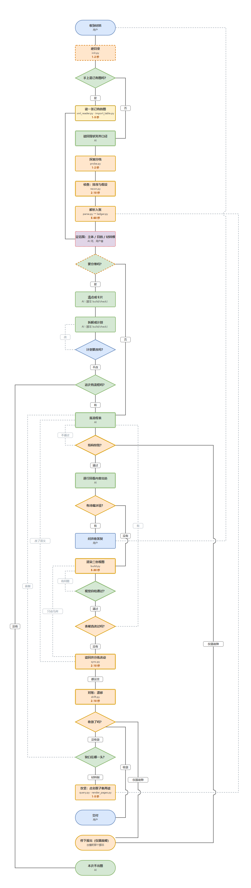

# flowchart-skill

[](SKILL.md)
[](dev/DECISIONS.md)

[](LICENSE)

> 🚀 当你整理思路时，AI 肯定给你生成过 Mermaid 流程图。但受 Agent 工具所限，渲染效果往往不佳，也缺少与 AI 的微操交互。这时，语言描述是匮乏的，你需要亲自动手，让 AI 知道你是常凯申，喜欢把机枪左移 20 米，把瞄准的节点从 A 切换到 B。此刻，你需要一个中间画板。用 drawio 看起来很美，但 AI 每次生成的风格都不统一，五花八门、随心所欲。因此，你需要这样一个工具：帮你整理思路，并且每个节点都要能补充备注信息；同时它还能生成一个 HTML 给老板看，且不依赖系统环境。



> 上图不是示意图，是这套工具画出来的**实际产物**——`flowchart-skill` 自己的主流程，一张没裁。
> 想看成规模的，`dev/baseline/` 里还有两套完整的自举成果（含代码地图），克隆下来双击 html 就能看。

---

## 📖 一句话本质

通过一句话来生成一套流程图的工具，SKILL 只是它的一种交互形式。

**🤖 AI 协作声明**

> 本仓库由人类开发者与 AI 协作完成，一次会话推进一段。之所以能这么干，是因为它**自带留痕**：
> 每一步"改过主意"的选择记在 `dev/DECISIONS.md`，每一条"知道但没做"的事记在 `dev/coding-spec.md`，
> 每个结论都挂着一件能重跑的仪器——**AI 会忘，日志和仪器不会**。
> 欢迎任何不服的 AI 来审这张表：它对着一套 `dev/verify/` 四个面与 `dev/tools/accept.py` 十二道门说话。

---

## ✨ 功能特性

- **支持多种材料接入**：不挑格式，也不挑来源——已有的流程图（哪怕别的工具画的）同样能接
- **只支持两种布局**：流程图和**泳道**
- **多层流程嵌套**：支持主流程节点嵌套子流程
- **留痕而不是卡点**：AI 智能分析逻辑缺口
- **多格式成果**：支持生成 html / drawio / svg

---

## 🏗️ 架构设计

```text
┌─────────────────────────────────────────────────────────────────┐
│[1] 读材料      合同 / 散表 / 白板 / 照片 / 已有流程图 / 口头需求│
└────────────────────────────────┬────────────────────────────────┘
                                ↓
┌─────────────────────────────────────────────────────────────────┐
│[2] 落《流程表》  12 列 = ICOM 列序；拿不准的地方就地留痕        │
│                  ← 唯一事实源，本身也是交付物                   │
└────────────────────────────────┬────────────────────────────────┘
                                ↓  ⚠ = AI 拿不准（图上画虚线）；结构校验 H1–H8 不过就阻断
┌─────────────────────────────────────────────────────────────────┐
│[3] 一条命令跑六环  结构校验 → 生成 DSL → 八项碰撞检测           │
│                    → 出首版产物 → 产物审核 → 几何自检           │
└────────────────────────────────┬────────────────────────────────┘
                                ↓  任一环不过：还原产物、exit 1
                                三份产物（html / drawio / svg）
```

---

## 🚀 快速开始

安装本 SKILL 并在提示词中触发使用。例如：

```text
请帮我将“D:\XXX.doc”转化成流程图
```

---

## 📁 目录

```text
SKILL.md              主入口：触发方式、标准处理流程、输出契约
scripts/              渲染与校验脚本（48 模块 = 30 个带 CLI 的入口 + 18 个纯库）
  dictionary.yaml     布局/配色/文字的数值字典
references/           出图时按需读的规范（7 份）
templates/            3 份模板（其中 2 份由 init.py 拷进 output/<名称>/：流程表骨架 + 自检清单；
                      另一份 flowtable-template.md 是**格式基准**，与 examples/workflow 逐字一致）
examples/workflow/    **格式基准**（SKILL 把自身工作流画成图，30 节点 / 41 边）
assets/               README 用图（从 dev/baseline 的产物里截的）
output/               出图产物目录（本地，不进库）
dev/                  **维护分区**——只有改仓库的人进来，出图时不需要读它
  dev/verify/             四个面自检（契约一致 / 门禁拦截 / 不变式 / 端到端）
  dev/tools/              七件仪器 + 一件清场工具（清单见 dev/tools/README.md：fn_graph / coverage / api_audit / equiv / layering / hygiene / aesthetic）
  baseline/           examples 的同构镜像：机器生成的产物（进库，安全网的基准）
  DECISIONS.md  ARCHITECTURE.md  REPO-MAP.md   设计文档
  coding-spec.md      代码质量自检对照表（行业原则 → 本仓库规则 → 拦它的仪器）
  _paths.py           全仓唯一的路径解析点
```

---

## 📤 输出契约

每个流程一个独立目录，文件名固定。产物名 = `<流程名>-flow.*`，流程名取**目录名**（表名是约定名 `flowtable` 时）或表名：

```text
output/<名称>/
├── flowtable.md        ← 事实源，也交付（语义变更的唯一入口）
├── checklist.md        ← 自检报告（AI 推断项在此留痕）
├── <名称>-index.md           ← 层级索引（派生物，build 自动刷新）
├── <名称>-flow.yaml           ← 内部中间表示，不交付；几何可手调、语义禁改
├── <名称>-flow.manifest.json  ← 渲染契约（自检产出），供渲染后反查
├── <名称>-flow.html           ← 交付物① 评审语义（**单文件**：有子图时整条层级内嵌在里面）
├── <名称>-flow.drawio         ← 交付物② 微调几何
└── <名称>-flow.svg            ← 交付物③ 朴素可编辑中间态
```

---

## 🤝 贡献

欢迎提交 Issue 和 Pull Request。提之前请先做两件事：

```bash
python dev/verify/run.py        # 四个面必须全绿
python dev/tools/accept.py      # 十二道门必须全过（含 API 面与审美两条）
```

- **先翻 `dev/coding-spec.md`**：里面有"已知不做"清单与"为什么不做"的理由——省得把一个被否决过的方案再提一遍
- **一条规则只在一处陈述**：同一件事写第二遍就是缺陷（另一处会漂），这是本仓库最硬的一条纪律
- **改了 `scripts/`** 就要重跑快照与基线：`python dev/tools/repin.py`（它会把该重造的重造、该重钉的重钉）

---

## 📋 维护日志

只记"它在动"，不记细节（细节在 `dev/DECISIONS.md`）。

- 2026-09-22　补齐 `⊞` 子表声明的两条校验；README 改版并加截图
- 2026-09-21　盲审清场收口；门禁补上 API 面
- 2026-09-19　审美三条（主轴 / 臂 / 就近）接进验收；撤掉"并行出图"
- 2026-09-17　自举树基线进库，开始守"产物逐字节不变"
- 2026-09-15　目录重构：样例改名 workflow、产物移进 dev/baseline

---

## 📄 许可证

MIT License，详见 [LICENSE](LICENSE)。

---

## 📞 联系方式

- **GitHub Issues**：[提交问题](https://github.com/Luys521/flowchart-skill/issues)
- **Pull Requests**：[贡献代码](https://github.com/Luys521/flowchart-skill/pulls)
- **仓库**：[github.com/Luys521/flowchart-skill](https://github.com/Luys521/flowchart-skill)

---
